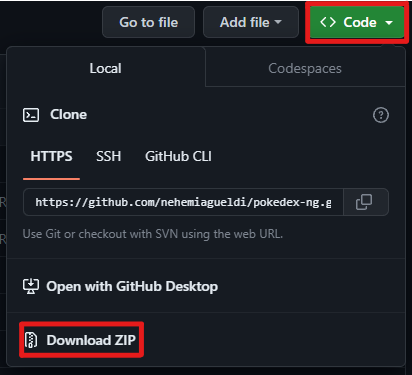

# Pokédex NG

Welcome to Pokédex NG, a web application that allows you to discover and explore all your favorite Pokémon! Visit the live website [**here**](https://pokemondexng.netlify.app).

Pokédex NG is a React-based Pokédex application that leverages the PokeAPI to provide comprehensive information about various Pokémon species. With this app, you can access details such as types, abilities, moves, stats, and more for each Pokémon. Additionally, you can add your favorite Pokémon to your collection and view them in the "My Pokémon" section.


## Features

- Browse and search Pokémon information
- View details of each Pokémon, including image, pokemon name, types, height, weight, abilities, moves, and stats
- Add and remove Pokémon from your favorites collection
- Responsive design for optimal viewing across different devices
- Pagination to navigate through a large number of Pokémon


## Technologies Used
- React: A JavaScript library for building user interfaces
- React Router: A routing library for React applications
- Axios: A promise-based HTTP client for making API requests
- Tailwind CSS: A utility-first CSS framework for styling
- PokeAPI: An open API for accessing Pokémon data
- PokeImg: An open API for accessing Pokémon image
## Run Locally

First you can download file from this repository 



After download file, to run the Pokédex NG application locally, follow these steps:

```bash
  npm install 
```

```bash
  npm install -D tailwindcss postcss autoprefixer react-router-dom axios
```

```bash
  npm start
```

Open your web browser and visit http://localhost:3000 to access the application.


## Deployment

- **Deploy to Vercel**

[](https://vercel.com/import/git?s=https://github.com/nehemiagueldi/pokedex-ng)


- **Deploy to Netlify**

[](https://app.netlify.com/start/deploy?repository=https://github.com/nehemiagueldi/pokedex-ng)


- **Clone this repository**
  
[](https://github.com/nehemiagueldi/pokedex-ng/generate)

## 📚 References

- [**React JS**](https://react.dev/)
- [**TailwindCSS**](https://tailwindcss.com/)
- [**Pokemon API**](https://pokeapi.co/docs/v2)
- [**Pokemon Image**](https://github.com/PokeAPI/sprites)


## ☕ Buy me a coffee

[](https://ko-fi.com/nehemiagueldi) [](https://sociabuzz.com/nehemiagueldi/donate)


## 🔗 Links

[](https://github.com/nehemiagueldi) [](https://www.linkedin.com/in/nehemiagueldi/) [](https://nehemiagueldi.github.io/) 


